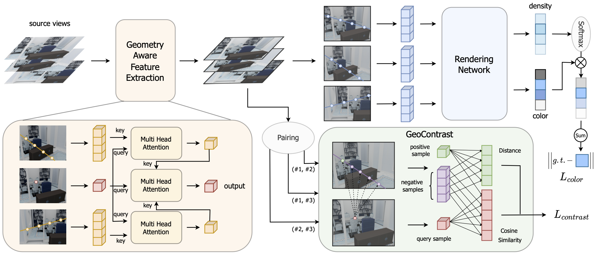

# ContraNeRF
PyTorch implementation of paper "ContraNeRF: Generalizable Neural Radiance Fields for Synthetic-to-real Novel View Synthesis via Contrastive Learning".



## Installation

We test the codes with Python3.9, and PyTorch1.11.
```
git clone https://github.com/ContraNeRF/ContraNeRF.git
cd ContraNeRF
```

## Datasets

### 3D-FRONT

Download 3D-FRONT dataset [here](https://tianchi.aliyun.com/specials/promotion/alibaba-3d-scene-dataset) and we process it with [BlenderProc](https://github.com/DLR-RM/BlenderProc) 
For each scene in 3D-FRONT, we sample 200 camera views and render each view at 640 × 480 resolution
The organization of the datasets should be the same as blow.

```
├──front3d/
    ├──0003d406-5f27-4bbf-94cd-1cff7c310ba1
        ├──color
            ├──00000.jpg
            ...
            ├──00199.jpg
        ├──pose
            ├──00000.txt
            ...
            ├──00199.txt
        ├──intrinsic.txt
    ...
    ├──fef4c9c4-a340-4388-908b-53f9a866731f
```

### ScanNet

Download ScanNet dataset [here](http://www.scan-net.org/) and we process it with official [codes](https://github.com/ScanNet/ScanNet). 
We uniformly sample one-tenth of views and resize each image to a resolution of 640 × 480 for use.
The organization of the datasets should be the same as blow.

```
├──scannet/
    ├──scene0289_00
        ├──color
            ├──00000.jpg
            ...
            ├──00136.jpg
        ├──pose
            ├──00000.txt
            ...
            ├──00136.txt
        ├──intrinsic.txt
    ...
    ├──scene0456_00
```

After processing the datasets, fill the data path in config files.

## Training

Run the following commands to train the model with multiple GPUs.

```
python -m torch.distributed.launch --nproc_per_node=4 --master_port=29500 train.py \
    --config configs/default.yaml\
    --distributed
```

## Citation

```
@article{yang2023contranerf,
  title={ContraNeRF: Generalizable Neural Radiance Fields for Synthetic-to-real Novel View Synthesis via Contrastive Learning},
  author={Yang, Hao and Hong, Lanqing and Li, Aoxue and Hu, Tianyang and Li, Zhenguo and Lee, Gim Hee and Wang, Liwei},
  journal={arXiv preprint arXiv:2303.11052},
  year={2023}
}
```